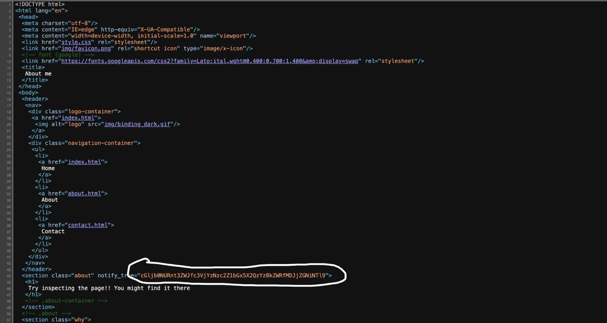
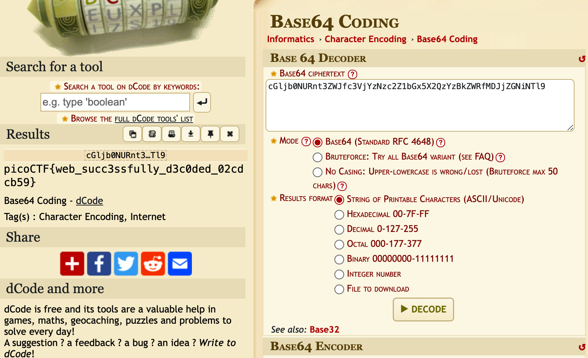

# 📌 Title: WebDecode

## 📂 Category: Web Exploitation

## ⭐ Difficulty: Easy

## 📝 Description:

## 🔹 **Step 1**  

### We open the link

### Then we see a hint on the main page - "Keep Navigating" 

## 🔹 **Step 2** 

### We start looking at the website code, nothing suspicious in the *‘home’* tab. 

### Then in the *‘about’* tab we notice a suspicious line 

### It looks a lot like base64 

## 🔹 **Step 3** 

### Let's test that theory and...

### Yes! It really is base64! ✅

## picoCTF{web_succ3ssfully_d3c0ded_02cdcb59}
